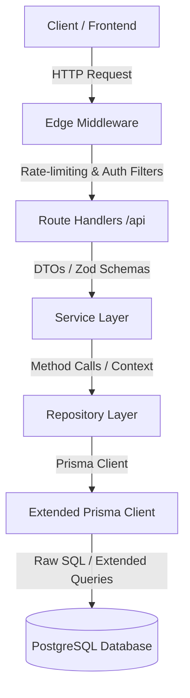

# Architectural Guide: Mikaelson School Club Platform

This guide outlines the architecture and software engineering design patterns used in the Mikaelson School Club codebase. The system follows a clean, layered architecture designed to isolate concerns, maintain testability, enforce type safety, and decouple transport layers from database models.

---

## Architecture Overview

The codebase is organized into four main layers:



---

## 1. Routing & Middleware Layer

### Edge Middleware (`middleware.ts`)
The Edge Middleware runs on the Vercel Edge network prior to hitting Next.js route handlers. It acts as the gatekeeper, performing:
- **Tracing**: Injects `x-request-id` headers for tracking requests.
- **CORS Handling**: Enforces allowed origin domains and intercepts preflight `OPTIONS` requests.
- **Content-Type Enforcement**: Mandates `application/json` for non-upload mutation endpoints.
- **Authentication**: Prevents unauthenticated access to paths under `/admin` and `/api/admin`.
- **Sliding-Window Rate Limiting**: Leverages Upstash Redis to restrict clients across tiers:
  - `public_write` (e.g. applications/contact): 5 requests per 10 minutes per IP.
  - `public_read` (e.g. blog, events, roster): 120 requests per minute per IP.
  - `admin` (e.g. admin actions): 200 requests per minute per user ID/IP.
  - `admin_upload` (file uploads): 10 uploads per minute per user ID.
- **Breach Logging**: Triggers a non-blocking background fetch to the secure route `/api/internal/log-breach` when any limit is breached to record details in the `RateLimitBreach` table.

### Next.js Route Handlers (`src/app/api/`)
Route handlers translate HTTP transport details into domain actions:
- **HTTP Handlers**: Define `GET`, `POST`, `PATCH`, `DELETE` operations.
- **Request Metadata**: Uses `getRequestMeta(req)` from `src/lib/audit` to capture caller IP and User Agent.
- **Session Parsing**: Leverages `getSession()` (a NextAuth wrapper) to check session tokens.
- **Role Guards**: Resolves permissions using `requireRole(allowedRoles)` in `src/lib/api-helpers.ts` (e.g., rejecting a `STUDENT` or `MENTOR` attempting admin actions).
- **Zod DTO Parsing**: Validates request bodies against schemas (e.g., `createSchoolSchema.safeParse(await req.json())`).

**Example: `src/app/api/admin/schools/route.ts`**
```typescript
export async function POST(req: Request) {
  try {
    const session = await getSession();
    const parsed = createSchoolSchema.safeParse(await req.json());
    if (!parsed.success) return badRequest(parsed.error.issues[0]?.message ?? "Invalid input.");

    const ctx = { 
      ...getRequestMeta(req), 
      actorId: session?.user?.id, 
      actorEmail: session?.user?.email 
    };
    const result = await createSchool(parsed.data, ctx);

    if (!result.success) return badRequest(result.error);
    return created({ success: true, id: result.id });
  } catch (err) {
    captureError(err, { route: "POST /api/admin/schools" });
    return serverError();
  }
}
```

---

## 2. Services Layer (`src/services/`)

The Service Layer encapsulates all business rules, transactional boundaries, validation outcomes, and side effects (like audit trails or email notifications).
- **Decoupled from HTTP**: Services have no knowledge of headers, cookies, request objects, or HTTP response statuses. They accept plain objects (DTOs) and a context object containing actor info.
- **Response Structure**: Return simple objects (e.g. `{ success: true, id }` or `{ success: false, error }`) instead of Throwing, maintaining readable control flows.
- **Audit Logging**: Responsible for recording audit logs (e.g., `writeAuditLog(...)`) detailing what existed before an operation and what changed after.

**Example: `src/services/school.service.ts`**
```typescript
export async function createSchool(
  input: CreateSchoolInput,
  ctx: ActorContext
): Promise<{ success: true; id: string } | { success: false; error: string }> {
  const existing = await schoolRepository.findByName(input.name);
  if (existing) {
    return { success: false, error: "A school chapter with this name already exists." };
  }

  const school = await schoolRepository.create(input);

  await writeAuditLog({
    actorId: ctx.actorId,
    actorEmail: ctx.actorEmail,
    action: "CREATE",
    model: "SchoolChapter",
    recordId: school.id,
    after: { name: school.name, status: school.status },
    ip: ctx.ip,
    userAgent: ctx.userAgent,
  });

  return { success: true, id: school.id };
}
```

---

## 3. Repositories Layer (`src/repositories/`)

Repositories act as a data access abstraction layer. They interface directly with the database client (Prisma) to perform CRUD and domain-specific queries.
- **Purpose**: Keeps Prisma APIs separated from business code. If queries need tuning or structure changes, modifications are confined to repository files rather than leaking into services.
- **Interface Segregation**: Expose distinct methods like `listPublic()`, `listAdmin()`, `findById()`, and `getRoster()` instead of passing general Prisma where clauses.

**Example: `src/repositories/school.repository.ts`**
```typescript
export const schoolRepository = {
  async create(data: CreateSchoolData) {
    return prisma.schoolChapter.create({ data });
  },

  async findById(id: string) {
    return prisma.schoolChapter.findFirst({ where: { id } });
  },

  async update(id: string, data: UpdateSchoolData) {
    return prisma.schoolChapter.update({ where: { id }, data });
  },

  async softDelete(id: string) {
    return prisma.schoolChapter.delete({ where: { id } });
  }
};
```

---

## 4. Libs & Extenders (`src/lib/`)

Shared helper functions, utility decorators, external adapters (e.g. Sentry, Resend, Vercel Blob), and database custom configurations reside in the lib folder.

### Extended Prisma Client (`src/lib/prisma.ts`)
Prisma is wrapped in an extension that intercept queries dynamically via `$extends` to handle soft-deletion:
1. **Model Register**: Models registered under `SOFT_DELETE_MODELS` (e.g. `User`, `SchoolChapter`, `BlogPost`, `Lesson`, `Project`) automatically undergo soft-delete intercept.
2. **Read Filters**: Reading operations (`findMany`, `findFirst`, `count`, etc.) automatically append `isDeleted: false` to request filters.
3. **Write Filters**: Intercepts `delete` and `deleteMany` calls, redirecting them to `update` and `updateMany` queries setting `isDeleted: true` and `deletedAt: new Date()`.
4. **Retention**: Records remain in the database for 30 days. After 30 days, they cannot be restored via the SUPERADMIN restore flow.

### File Storage Pipeline (`src/lib/storage.ts`)
Encapsulates image uploads to Vercel Blob. Before sending bytes to the network:
- **Type Checking**: Validates against allowed MIME types.
- **Size Checking**: Enforces a `5MB` hard upload limit.
- **Sharp Processing**:
  - Excludes GIF files to preserve animation frames.
  - Resizes non-GIF images exceeding 1200px width down to 1200px.
  - Compresses and converts images to WebP at 80% quality to optimize bandwidth.

---

## Development & Troubleshooting Cheat Sheet

### TypeScript Cache Issues
Sometimes after running `npx prisma generate` to add new models, your editor's TypeScript background worker may report that a model does not exist (e.g. `Property 'rateLimitBreach' does not exist on type...`).
To resolve this:
- Run `npx tsc --noEmit` from your terminal to verify that the build compiles successfully.
- If it compiles but your editor still shows red squiggles, restart your editor's TypeScript server:
  - **VS Code**: Press `Ctrl+Shift+P` (or `Cmd+Shift+P` on macOS), search for `TypeScript: Restart TS Server`, and hit Enter.

### Testing Commands
- **Unit Tests** (runs with mocked Prisma): `npm run test`
- **Integration Tests** (runs with unmocked Postgres database): `npm run test:integration`
- **Schema sync**: Run `$env:DATABASE_URL="..."; npx prisma db push` to push schema changes directly to test database instances.
